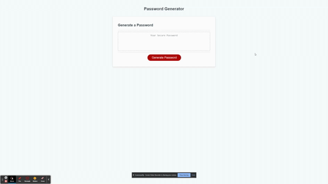
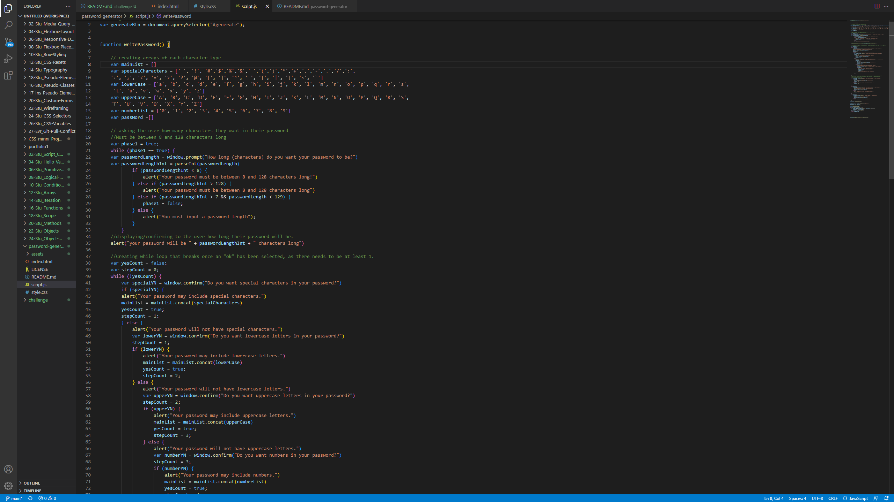
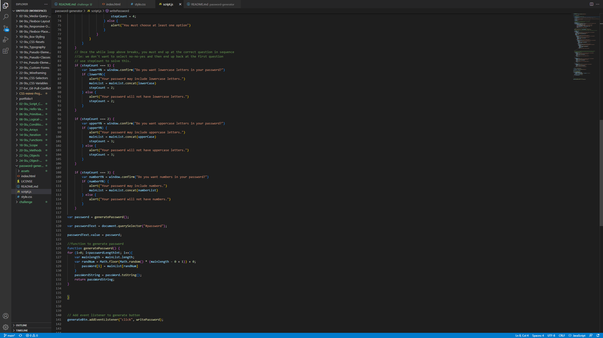

# password-generator

## Description

password-generator is an application that creates a randomly generated group of characters
to be used as a password.  Upon clicking the "generate password" button, the user is prompted
to select a length for their password, which must be between 8 and 128 characters long. The User
is then given a series of prompts asking whether the user wishes to include different groups of 
characters or not.  These groups include special characters, lowercase, uppercase, and numbers.  Once 
these prompts are completed a password is generated and displayed on the screen. 

## Technologies Used
* HTML
* CSS
* javascript
* Visual Studio Code
* git
* gitbash

## Application and deployed link

https://ltmccarthy9.github.io/password-generator/

## Uses

Used for generating personal passwords.

## Code

## License

MIT License

Copyright (c) 2022 Liam McCarthy

Permission is hereby granted, free of charge, to any person obtaining a copy
of this software and associated documentation files (the "Software"), to deal
in the Software without restriction, including without limitation the rights
to use, copy, modify, merge, publish, distribute, sublicense, and/or sell
copies of the Software, and to permit persons to whom the Software is
furnished to do so, subject to the following conditions:

The above copyright notice and this permission notice shall be included in all
copies or substantial portions of the Software.

THE SOFTWARE IS PROVIDED "AS IS", WITHOUT WARRANTY OF ANY KIND, EXPRESS OR
IMPLIED, INCLUDING BUT NOT LIMITED TO THE WARRANTIES OF MERCHANTABILITY,
FITNESS FOR A PARTICULAR PURPOSE AND NONINFRINGEMENT. IN NO EVENT SHALL THE
AUTHORS OR COPYRIGHT HOLDERS BE LIABLE FOR ANY CLAIM, DAMAGES OR OTHER
LIABILITY, WHETHER IN AN ACTION OF CONTRACT, TORT OR OTHERWISE, ARISING FROM,
OUT OF OR IN CONNECTION WITH THE SOFTWARE OR THE USE OR OTHER DEALINGS IN THE
SOFTWARE.
